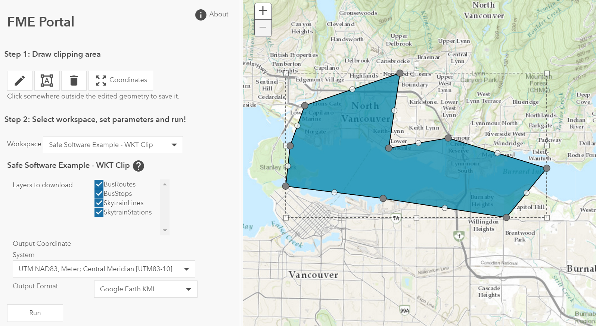
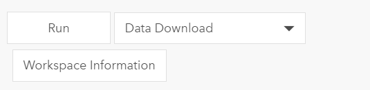

# dojo-fmeserver-portal
The municipality of Gävles FME portal - A configurable webb portal 
developed using Dojo and ESRI:js JavaScript API.
The portal is a dojo widget that can be integrated in a mapping 
application. The purpose of the widget is to allow 
quick setup of customized portals for easy access to
FME workspaces stored on FME-server.

**Features:**
- Authentication using credentials or tokens, auto-sign-in option
- Two "portal modes", admin or custom mode.
- Most FME parameter types are supported and represented as dijit form widgets.
- File Upload forms.
- Map and drawing tools for managing clipping geometries, right-click to apply buffer.
- Simple JSON configuration.
- Internationalization (en, sv).
- Supports FME-server service types Data Download, Job Submitter and Data Streaming.
- Access workspace metadata and see running and queued jobs on FME-server

## Table of Contents

- [Examples](#examples)
- [Usage](#usage)
- [Configuration](#configuration)
   - [Server](#server)
   - [Uploads](#uploads)
   - [Included Workspaces](#included-workspaces)
   - [Custom error messages](#custom-error-messages)
   - [Geometry](#geometry)
   - [Map](#map)
- [Internationalization](#internationalization)
- [History](#history)
- [Credits](#credits)
- [License](#license)

## Examples
**The examples are connected to a [Safe Software](https://www.safe.com) demo FME-server.**

**[Demo 1 - Automatic sign-in using a token, four workspaces configured](https://gis.gavle.se/pubs/fmeportal/examples/demo2.html)**

**[Demo 2 - Authenticate using a token or credentials with possibility to change server url and admin-mode](https://gis.gavle.se/pubs/fmeportal/examples/demo1.html)**

## Usage

Define a package pointing to the widget location in the dojoConfig. Use the src for development or the optimized built version of the widget in the **dist** folder.

Include ESRI:s JavaScript API or Dojo. Remember to set dojoConfig before loading Dojo.

     
    

Initialize the widget by passing a map (optional), a configuration object and a DOM-node or a DOM id to the widget constructor.

Example: 

    

**CSS**

All symbols except the loader gif are from Google Material Icons. 
ESRI:s JavaScript API require esri.css for the map and a dijit theme 
like calcite, tundra, claro etc. to render the forms correctly. 
More information about esri css [here](https://developers.arcgis.com/javascript/3/jshelp/css.html).

    <link rel="stylesheet" href="https://js.arcgis.com/3.18/esri/css/esri.css">
    <link rel="stylesheet" href="https://js.arcgis.com/3.18/esri/themes/calcite/dijit/calcite.css">
    <link href="https://fonts.googleapis.com/icon?family=Material+Icons" rel="stylesheet">

## Configuration
For a full configuration example, see **src/app/FMEPortal/Config**.

### General

Set a unique id for the portal, a title and the about popup contents. The id is used to remember token and server settings in the browsers localStorage on refresh.

    "general": {
        "id": "portal-1",
        "title": "FME Portal",
        "about": "About this FMEPortal..."
    }

### Server

The server section of the configuration controls the portal mode, authentication options, FME-server url and API-version.

Example:

        { 
           "server": {
               "adminMode": false,
               "token": {
                  "token": "568c604bc1f235bbe137sdfgh32h45h45bh",
                  "time": 480,
                  "unit": "minute",
                  "showTokenTab": true,
                  "autoLogin": false
               },
               "url": "https://my-fmeserver.com",
               "version": "v2",
               "showSettingsTab": true
        }

#### adminMode
True/False

If adminMode is enabled, the portal will query FME-server for all repositorys and workspaces the authenticated user has access too and populate two dropdowns.

Additionally, workspace forms will have two extra options next to the Run button:
 - A service type selector allowing the user to run a workspace using a specific registered service 
 - A button to show metadata about the workspace.
 - 

If adminMode is disabled, specific workspaces to include in the portal must be set using the **includedWorkspaces** option.

#### token
 - **token** - Default token (optional)
 - **time** - Token lifespan
 - **unit** - Token lifespan unit
 - **showTokenTab** - True/False - Allow the user to sign in using a token
 - **autoLogin** - True/False - Use the supplied **token** to automatically sign in the visitor.

#### url
The FME-server base url.

#### version
The API version, currently v2 and v3 are supported.

#### showSettingsTab
True/False

Allow the visitor to change server **url** and set **adminMode** before signing in.

### Uploads
Disable selection of specific filetypes for upload to FME-server.

Example:

    "uploadSettings": { 
       "disabledFiles": [".shx", ".prj", ".dbf", ".sbn", ".sbx", ".lock", ".png", ".xml", ".jpg", ".doc", ".docx", ".skp"]
    }

### Included workspaces

Array of workspaces to include in the portal, each item must have:

  - **title** - The workspace title.
  - **description** - Description of the workspace. Visible when the user clicks the question mark.
  - **repository** - Name of the FME-server repository.
  - **workspace** - Name of the FME-server workspace (including *.fmw)
  - **service** - The registered service type to use when running the workspace, "fmedatadownload", "fmejobsubmitter" and "fmedatastreaming" are supported.

Example:

    "includedWorkspaces": [
        {
            "title": "WKT Clip",
            "description": "Description of the WKT Clip workspace.",
            "repository": "REST-Playground",
            "workspace": "WKTClip.fmw",
            "service": "fmedatadownload"
        },{
            "title": "Austin Transport example",
            "description": "Description of the Austin Transport workspace.",
            "repository": "REST-Playground",
            "workspace": "AustinTransport.fmw",
            "service": "fmedatastreaming"
        }
    ]

### Custom error messages

Map error codes reported from FME Terminator transformers to specific error messages.

This can be useful for sending back messages from a workspace when something is wrong and a terminator is triggered.

Example:

     "customErrors": {
         "101": "No data in the area.",
         "102": "Draw a smaller area to extract data...",
         "103": "You don't have permission to extract data in the area"
      }

### Geometry
Drawing tools will automatically appear when a selected workspace have a parameter name defined in the geometry section. The drawn geometry will be passed to the server as a string in the specified format. A map is required.

  - **parameter** - The name of the workspace parameter that is used to send a clipping geometry to the server
  - **format** - The geometry-format that is sent to the server, **geojson** or **esrijson** are supported.

Example:

    "geometry": {
        "parameter": "GEOM",
        "format": "geojson"
    }

### Map
If a map is used, these settings are required.

  - **drawColor** - The color used for map drawings (rgba).
  - **bufferColor** - The color used for the original geometry when a buffer is applied (right click on a geometry) (rgba).
  - **geometryService** - An ArcGIS Server geometry service used to buffer geometry and calculate areas and lengths.

Example:

    "map": {
        "drawColor": [255, 170, 0, 0.75],
        "bufferColor": [0, 0, 0, 0.25],
        "geometryService": "https://tasks.arcgisonline.com/arcgis/rest/services/Geometry/GeometryServer"
    }

## Internationalization
The widget is internationalized in English, **en**, (default) and Swedish, **sv**. see the **FMEPortal/nls** folder.

More on Dojo internationalization here: https://dojotoolkit.org/documentation/tutorials/1.10/i18n/.

## History
**2019-03-08** - Add support for the opt_namespace parameter. Create new file upload session on each portal visit. Fix an issue that the geometry needed to be redrawn when changing workspace.

**2016-12-26** - Add support for FME-server REST versions, v2 and v3. FMEServer JavaScript library is no longer required. The new RestManager module manages FME-server communication.

**2016-12-18** - v1.0 First release
## Credits
dojo-fmeserver-portal was developed by Peter Jäderkvist at Community Development Gävle.
## License
dojo-fmeserver-portal is released under the MIT license.